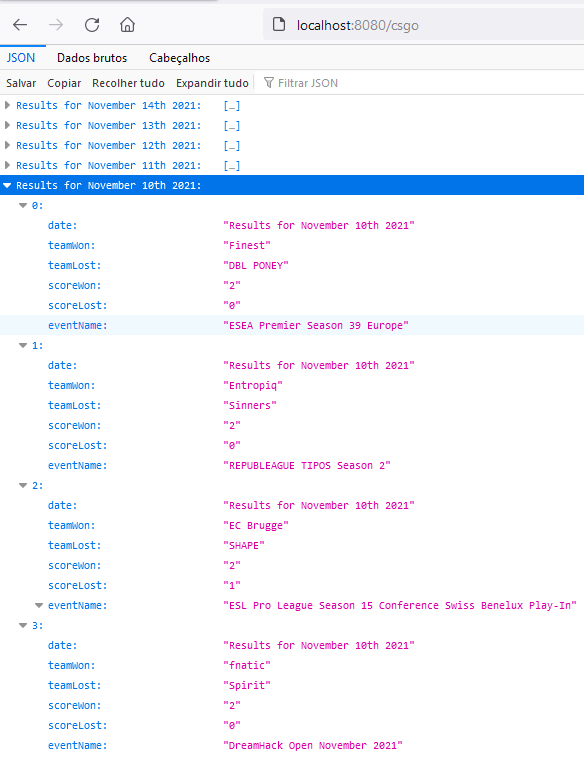
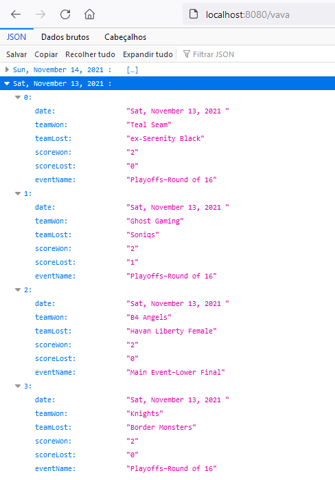
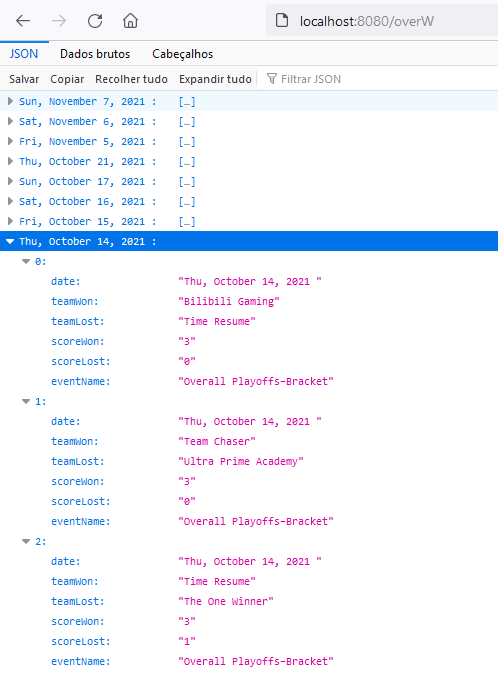

# Competitive Results API
An API to get the latest results from CSGO, Valorant and Overwatch tournaments. 

# Pre-requisites
- Install [Node.js](https://nodejs.org/en/)

# Getting started
- Clone the repository

- Install dependencies
```
npm install
```
- Run the project
```
node index.js
```
  Navigate to `http://localhost:8080`

# There are one route to each game:
- Data is acquired through scraping different sites, been them the main news site of each game, thus the quantity of data can change between the games.

## CS:GO: `/csgo`


## Valorant: `/vava`


## Overwatch: `/overw`


